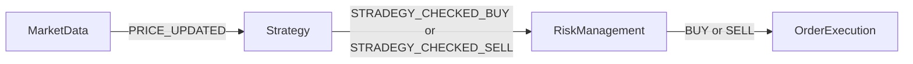

# Binance API Documentation

[Binance API Documentation｜Web-socket-api](https://github.com/binance/binance-spot-api-docs/blob/master/web-socket-api.md)

[Binance API Documentation｜Rest-api](https://github.com/binance/binance-spot-api-docs/blob/master/rest-api.md)

# Structure

### 主要模組
1. MarketData : 訂閱 k 棒，並且存放歷史 k 棒數據
2. Strategy
3. RiskManagement
4. OrderExecution
5. PositionManagement

### 其他模組
1. main.py : 用來初始化 instance, 並以開始訂閱 k 棒為整個交易機器人的開端
2. BinanceAPIClient : 都是被其他模組呼叫的，整理在一起統一管理 API
3. SignalList : 用來存放所有的 signal
4. Dispatcher : 事件總線
5. Logger : logging

### 訊號
###### 種類
PRICE_UPDATED = "price_updated"  
STRADEGY_CHECKED_BUY = "stradegy_checked_buy"  
STRADEGY_CHECKED_SELL = "stradegy_checked_sell"  
RISK_CHECKED_BUY = "risk_checked_buy"  
RISK_CHECKED_SELL = "risk_checked_sell"  
BUY = "buy"  
SELL = "sell"  
ORDER_PLACED = "order_placed"  
ORDER_FILLED = "order_filled"  
STOP_LOSS = "stop_loss"  
TAKE_PROFIT = "take_profit"  

###### 訊號流

---
Docker 包含 Grafana 以及 Loki